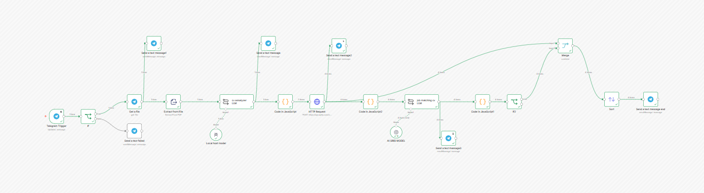
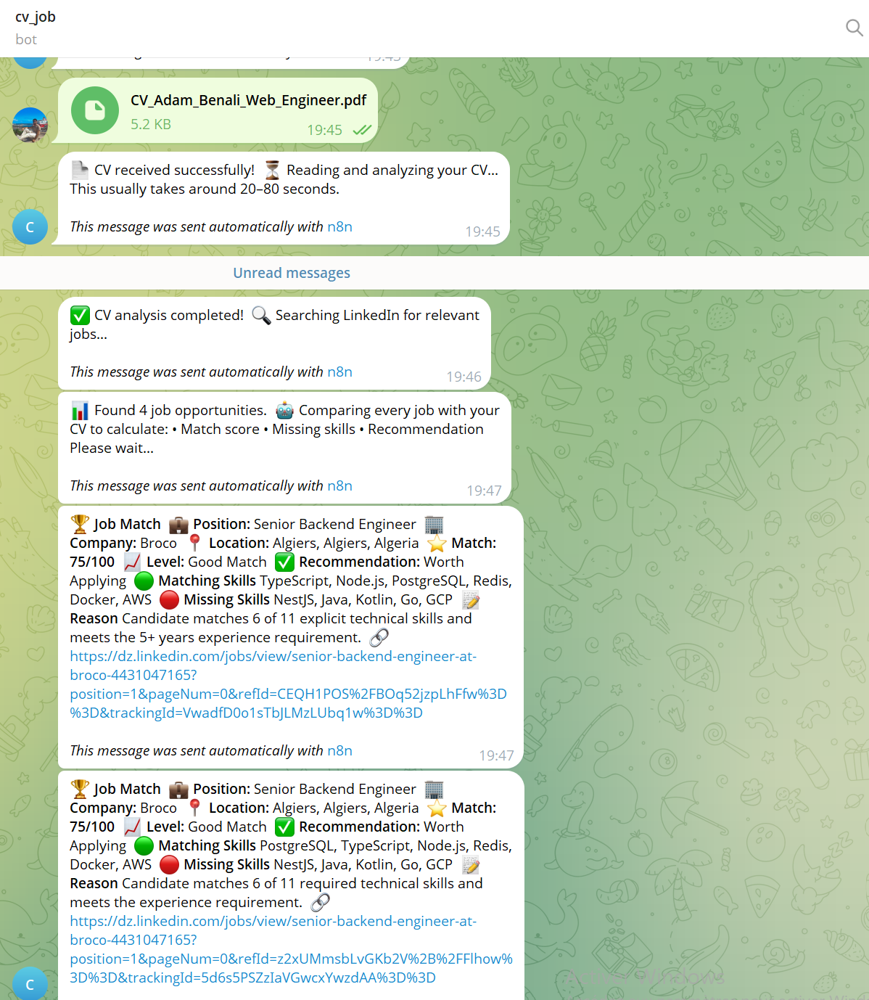

# 🤖 AI CV Job Matcher



An AI-powered workflow built with **n8n**, **Ollama**, **AI Grid LLM API**, and **Telegram** that automatically analyzes a candidate's CV, searches LinkedIn jobs, evaluates every opportunity using AI, calculates an ATS-style match score, and sends personalized recommendations directly to Telegram.

---

## 🚀 Features

- 📄 Upload CV directly from Telegram
- 🤖 AI-powered CV parsing using Local LLM (Ollama)
- 🔍 Automatic LinkedIn job search
- 🧠 AI evaluation of every job using AI Grid LLM API
- ⭐ ATS-style compatibility score (0–100)
- 🟢 Detect matching skills
- 🔴 Detect missing skills
- 📈 Rank jobs by compatibility
- 💬 Send Top Matching Jobs directly to Telegram
- ⚡ Fully automated n8n workflow

---

# 🏗️ System Architecture


```text
User
 │
 ▼
Telegram Bot
 │
 ▼
Upload CV
 │
 ▼
Extract PDF Text
 │
 ▼
Ollama (Local LLM)
 │
 ▼
Candidate JSON
 │
 ▼
LinkedIn Jobs API
 │
 ▼
Retrieve Job Descriptions
 │
 ▼
AI Grid LLM API
 │
 ▼
Evaluate Each Job
 │
 ▼
Calculate ATS Score
 │
 ▼
Sort Jobs
 │
 ▼
Top Matching Jobs
 │
 ▼
Telegram Response
```

---

# 🖥 Workflow


The workflow is fully automated inside **n8n**.

Main steps:

1. Receive CV from Telegram
2. Download PDF
3. Extract text
4. Parse CV using Ollama
5. Search LinkedIn jobs
6. Retrieve full job descriptions
7. Evaluate each job using AI Grid
8. Calculate ATS score
9. Sort jobs
10. Send best jobs to Telegram

---

# 📊 ATS Scoring System

| Category | Weight |
|----------|--------|
| Technical Skills | 40 |
| Experience | 25 |
| Education | 15 |
| Projects | 10 |
| Languages | 10 |

**Total Score = 100**

---

# 📈 Match Levels

| Score | Level |
|-------|-------|
| 90–100 | Excellent Match |
| 80–89 | Very Good Match |
| 70–79 | Good Match |
| 60–69 | Fair Match |
| Below 60 | Poor Match |

---

# 💬 Telegram Output

The user receives the best matching jobs directly in Telegram.

Each result includes:

- Job Title
- Company
- Location
- ATS Score
- Match Level
- Recommendation
- Matching Skills
- Missing Skills
- Job Link

Example:



```text
🏆 Job Match

💼 Position:
Data Analyst

🏢 Company:
Yassir

⭐ Match:
91/100

📈 Level:
Excellent Match

🟢 Matching Skills
Python, SQL, Power BI

🔴 Missing Skills
Tableau

✅ Recommendation
Apply Immediately
```

---

# 🛠 Technologies

## Workflow Automation

- n8n (Localhost)

## Artificial Intelligence

- Ollama (Local LLM)
- AI Grid API (Cloud LLM)

## APIs

- Telegram Bot API
- LinkedIn Jobs API

## Programming

- JavaScript
- JSON

---

# 🧠 AI Capabilities

The system uses AI to:

- Extract structured CV information
- Detect technical skills
- Extract work experience
- Extract education
- Compare candidate profile with job requirements
- Detect missing skills
- Generate ATS compatibility scores
- Rank opportunities automatically

---

# 📂 Project Structure

```
AI-Job-Matching-System
│
├── workflow/
│   └── AI-Job-Matching-System.json
│
├── screenshots/
│   ├── Workflow.png
│   └── telegram-result.png
│
├── README.md
├── LICENSE
└── .gitignore
```

---

# 🚀 Installation

Clone the repository

```bash
git clone https://github.com/abdelhakakachat/AI-CV-Job-Matcher.git

cd AI-CV-Job-Matcher
```

---

## Requirements

- n8n
- Ollama
- AI Grid API Key
- Telegram Bot Token
- LinkedIn Jobs API

---

## Start Ollama

```bash
ollama serve
```

---

## Start n8n

```bash
n8n start
```

---

## Import Workflow

Open n8n

Import

```
workflow/job_cv_matcher.json
```

---

## Configure Credentials

Configure:

- Telegram Bot Token
- AI Grid API Key
- LinkedIn API
- Ollama endpoint

---

## Run

Upload a CV to the Telegram bot.

The entire workflow executes automatically.

---

# 🔒 Security

This repository **does not include**:

- API Keys
- Access Tokens
- Personal Data
- Credentials

---

# 🙏 Acknowledgements

Special thanks to:

- **AI Grid** for providing free access to powerful Large Language Models through their API, enabling cloud-based AI evaluation.
- **Ollama** for local LLM inference.
- **n8n** for workflow automation.
- **Telegram Bot API**.
- **LinkedIn Jobs API**.

---

# 👨‍💻 Author

**abdelhak Akachat**

Master's Student in Statistics & Data Science

Interested in:

- Artificial Intelligence
- Data Science
- Machine Learning
- Workflow Automation
- Large Language Models
- MLOps


---

